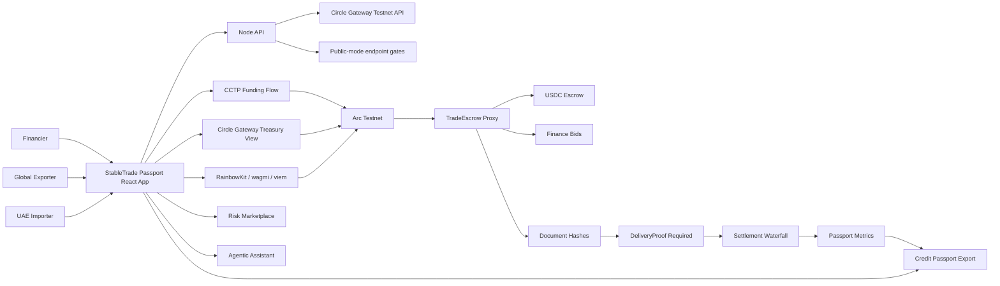

# StableTrade Passport

> **Escrow-secured invoice financing and a portable SME credit passport, settled in USDC on Arc.**

[](https://stabletradepassport.vercel.app)
[](https://stabletradepassport.vercel.app)
[](https://testnet.arcscan.app)
[](https://www.circle.com/usdc)

**StableTrade Passport** is a Track 2 submission for the **Stablecoin Commerce Stack Challenge: SME Trade Finance & Working Capital**.

🔗 **Live demo:** https://stabletradepassport.vercel.app · 🧭 **Architecture:** [`/architecture.html`](https://stabletradepassport.vercel.app/architecture.html) · 📄 **Submission:** [`SUBMISSION.md`](./SUBMISSION.md)

### The 60-second pitch

Cross-border SMEs wait *weeks* to get paid. Importers won't release funds without proof of delivery; exporters need working capital *before* they ship; financiers who could bridge the gap have no verifiable repayment history to price the risk. Working capital stays trapped and credit stays expensive — especially on emerging-market corridors (UAE → Nigeria, Rwanda, Ghana).

StableTrade Passport runs the **entire trade-finance lifecycle on programmable stablecoin rails**: a UAE importer escrows USDC on Arc, financiers *compete* to advance working capital, delivery proof *gates* settlement, a transparent waterfall pays all three parties atomically, and every completed trade compounds into a reusable **onchain credit passport** that any future financier can underwrite against.

Most stablecoin demos stop at "send money." This one encodes real **business state** — escrow conditions, competitive financing, proof gates, and a credit primitive that gets more valuable with every trade.

> Educational and testnet only. This project uses Arc Testnet, testnet USDC, browser-wallet signing, and gated demo helpers. It is not a production financial service.

## What It Solves

SMEs often wait weeks for cross-border invoices to settle. Buyers want proof before releasing funds, exporters need liquidity before delivery, and financiers need reliable payment history before pricing credit.

The app handles the trade in six steps:

1. **Escrow** — Importer creates an invoice and funds escrow in USDC.
2. **Finance** — Financiers compete to advance working capital against the receivable.
3. **Accept** — Exporter accepts the best financing offer and receives an advance before shipping.
4. **Prove** — Delivery proof is hashed and anchored to the invoice onchain.
5. **Settle** — Settlement repays financier principal plus fee, deducts protocol fee, and pays the exporter remainder — atomically.
6. **Passport** — The app updates a portable credit passport for later underwriting.

## Why It Fits Track 2

Track 2 asks for invoice finance, escrow, settlement, working-capital workflows, and verifiable payment history. StableTrade Passport covers that surface area:

- **Stablecoin escrow** for importer/exporter settlement.
- **Receivables financing** through financier bids and exporter acceptance.
- **Repayment waterfall** showing principal, financier fee, protocol fee, and exporter payout.
- **Proof-of-delivery gate** before settlement release.
- **SME credit passport** built from onchain settlement behavior and document hashes.
- **Treasury and funding rails** using Circle Gateway and CCTP concepts.

## Product Features

| Feature | What it does |
| --- | --- |
| Dashboard | Presents the Track 2 thesis, workflow state, and core metrics. |
| Trades | Creates invoices, funds escrow, accepts bids, anchors documents, and releases settlement. |
| Financing Marketplace | Scores receivables by risk, proof coverage, advance ratio, fee bps, and expected APR. |
| Settlement Waterfall | Shows how escrow is split between financier repayment, protocol fee, and exporter payout. |
| Treasury Console | Queries Circle Gateway testnet balances and stages USDC liquidity for Arc settlement. |
| CCTP Funding | Shows the approve -> burn -> attestation -> mint path for funding Arc with USDC. |
| Agentic Assistant | Recommends next actions from invoice, Gateway, CCTP, and passport state without auto-signing. |
| Credit Passport | Exports a JSON/QR proof package with contract, invoice, document, and repayment history. |
| System Page | Shows chain ID, proxy address, version, pause state, fee settings, and wallet status. |

## Circle And Arc Usage

| Product | Usage in StableTrade Passport |
| --- | --- |
| **USDC** | Escrow asset, exporter advance asset, financier repayment asset, protocol-fee asset. |
| **Arc Testnet** | EVM settlement layer for invoices, bids, delivery proofs, settlement, and passport reads. |
| **Circle Gateway** | Treasury balance view across Arc, Base Sepolia, Ethereum Sepolia, and Arbitrum Sepolia. |
| **CCTP / Bridge Kit / Circle App Kit** | Cross-chain USDC funding path into Arc. |
| **Circle Wallets** | Planned onboarding model for non-crypto-native SMEs. The MVP signs testnet actions with RainbowKit, wagmi, and viem. |
| **USYC** | Optional cash-management extension for idle treasury or escrow float if enterprise access is granted. |

## Architecture



Architecture page: `/architecture.html`

## Smart Contracts

StableTrade uses an upgradeable Arc Testnet escrow stack.

| Component | Address |
| --- | --- |
| TradeEscrow proxy | `0xF167a3f1E362dBDC7d365A9Cb9340C8513e7188b` |
| StableTradeFactory | `0x2d34ff5B7418e8c1Fcf3EAEc1aeC16EDc7aa6586` |
| Frontend implementation reference | `0x6f62468D584406d177460Ad2353c7D2C19Ecf6bB` |
| Arc Testnet USDC | `0x3600000000000000000000000000000000000000` |
| Chain ID | `5042002` |
| Explorer | `https://testnet.arcscan.app` |

Core contract actions:

- `createInvoice(exporter, amount, advanceAmount, metadataHash)`
- `fundEscrow(invoiceId)`
- `submitFinanceBid(invoiceId, advanceAmount, feeBps)`
- `acceptFinanceBid(invoiceId, bidIndex)`
- `addTradeDocument(invoiceId, kind, documentHash)`
- `releaseOnDelivery(invoiceId)` after `DeliveryProof` exists
- `passport(address)`

The current code requires delivery proof before settlement release. If the proxy still points to an older implementation, deploy the latest V3 implementation and upgrade the proxy before the submission video.

## Repository Structure

```text
.
├── contracts/          # Foundry contracts, scripts, tests
├── frontend/           # React + Vite DApp
├── server/             # Node API and public-mode tests
├── public/             # Legacy static fallback and architecture page
├── SUBMISSION.md       # Challenge submission copy
└── README.md
```

## Deploy to Vercel

The repo ships with `vercel.json` and `api/index.js`, so a deploy is fully configured out of the box. The Vite frontend is served from Vercel's CDN and the Node API (`server/index.js`) runs as a serverless function under `/api`.

### Option A — One click from the dashboard (recommended)

1. Push this repo to GitHub (already at `https://github.com/fawazdevx/Stabletrade-passport`).
2. Go to **vercel.com → Add New → Project → Import** the repository.
3. Leave **Root Directory** as the repo root. Vercel auto-detects `vercel.json`:
   - Build command: `cd frontend && npm install && npm run build`
   - Output directory: `frontend/dist`
   - Serverless function: `api/index.js`
4. Add the frontend environment variables under **Settings → Environment Variables** (Production + Preview):

   ```bash
   VITE_ARC_RPC_URL=https://rpc.testnet.arc.network
   VITE_ARC_CHAIN_ID=5042002
   VITE_USDC_ADDRESS=0x3600000000000000000000000000000000000000
   VITE_TRADE_ESCROW_PROXY=0xF167a3f1E362dBDC7d365A9Cb9340C8513e7188b
   VITE_STABLE_TRADE_FACTORY=0x2d34ff5B7418e8c1Fcf3EAEc1aeC16EDc7aa6586
   VITE_WALLETCONNECT_PROJECT_ID=your_walletconnect_project_id
   VITE_GATEWAY_API_BASE_URL=https://gateway-api-testnet.circle.com/v1
   ```

5. Click **Deploy**. Public mode is the default — no demo-mutation or admin flags are needed for the judge-facing site.

### Option B — Vercel CLI

```bash
npm i -g vercel
vercel login
vercel            # preview deploy; accept the detected settings
vercel --prod     # promote to production
```

Set the same `VITE_*` variables with `vercel env add <NAME> production` (or in the dashboard) before the production build.

### After deploying, verify

- `https://<your-app>.vercel.app` loads the Dashboard.
- `https://<your-app>.vercel.app/architecture.html` renders the architecture page.
- `https://<your-app>.vercel.app/api/health` returns JSON with `publicMode: true`.
- Treasury Console shows live Circle Gateway balances (served through the `/api/gateway/balances` function).

> The serverless function stays in **public mode** by default: mutation and IPFS-upload endpoints are gated off, and no secrets are required. Do not set `ADMIN_TOKEN` or `ENABLE_*` flags on the public deployment.

## Run Locally

### 1. Build the React app

```bash
cd frontend
npm install
npm run build
```

### 2. Start the Node API and public app

```bash
cd ..
npm install
PORT=4174 npm run dev
```

Open:

```text
http://127.0.0.1:4174
```

Health check:

```text
http://127.0.0.1:4174/api/health
```

### 3. Run the Vite dev server

```bash
cd frontend
npm run dev
```

Open:

```text
http://127.0.0.1:5173
```

The Vite server proxies `/api` to `http://127.0.0.1:4174`.

## Frontend Environment

Create `frontend/.env.local` only if you need to override defaults:

```bash
cd frontend
cp .env.example .env.local
```

Important values:

```bash
VITE_ARC_RPC_URL=https://rpc.testnet.arc.network
VITE_ARC_CHAIN_ID=5042002
VITE_USDC_ADDRESS=0x3600000000000000000000000000000000000000
VITE_TRADE_ESCROW_PROXY=0xF167a3f1E362dBDC7d365A9Cb9340C8513e7188b
VITE_WALLETCONNECT_PROJECT_ID=your_walletconnect_project_id
```

Do not commit `.env`, private keys, deployer secrets, Pinata JWTs, or admin tokens.

## Contract Development

```bash
cd contracts
forge build
forge test
```

Upgrade the proxy with the existing Foundry account:

```bash
source .env
forge script script/UpgradeTradeEscrowV3.s.sol:UpgradeTradeEscrowV3 \
  --rpc-url $ARC_RPC_URL \
  --chain-id $ARC_CHAIN_ID \
  --account deploytestKey \
  --sender $OWNER \
  --broadcast
```

After upgrading, keep the proxy address stable in the frontend. Only update the implementation reference if you want the System page and docs to show the latest implementation address.

## Backend API

| Endpoint | Public behavior |
| --- | --- |
| `GET /api/health` | Returns app, chain, public mode, and static-root status. |
| `GET /api/invoices` | Returns read-only sample invoices and events. |
| `POST /api/gateway/balances` | Proxies Circle Gateway testnet `/balances`; sample fallback is opt-in. |
| `POST /api/cctp/demo-receipt` | Disabled in public mode unless explicitly enabled. |
| `POST /api/ipfs/upload` | Disabled in public mode unless explicitly enabled. |
| `POST /api/demo/seed` | Disabled in public mode unless explicitly enabled. |
| `POST /api/invoices` | Disabled in public mode unless explicitly enabled. |

Public mode is the default. Local-only helpers require one of:

```bash
ENABLE_DEMO_MUTATIONS=true
ENABLE_DEMO_FALLBACKS=true
ENABLE_IPFS_UPLOADS=true
ENABLE_GATEWAY_SAMPLE_FALLBACK=true
ADMIN_TOKEN=local_admin_token
```

## Suggested Judge Walkthrough

Use this flow in the submission video:

1. Open the Dashboard and explain the Track 2 use case.
2. Open System and show Arc Testnet, proxy, contract version, pause state, and fee settings.
3. Open Trades and show invoice creation, escrow funding, delivery proof, and settlement controls.
4. Open Marketplace and show risk scoring, suggested advance, financier fee bps, and expected APR.
5. Open Treasury and show live Gateway API status.
6. Open CCTP Funding and explain the approve, burn, attestation, mint path into Arc.
7. Open Trades again and show the settlement waterfall.
8. Open Passport and export the SME credit passport JSON/QR.
9. Open Assistant and show prepare-only recommendations.

## Verification

Run these before submitting:

```bash
cd frontend
npm run build
```

```bash
node --check server/index.js
node --test server/public-readiness.test.js
```

```bash
cd contracts
forge test
```

## Submission Checklist

- Title: **StableTrade Passport**
- Track: **Track 2: SME Trade Finance & Working Capital**
- Demo URL: **https://stabletradepassport.vercel.app**
- Functional MVP: React app, Node backend, Arc Testnet contracts
- Architecture diagram: `/architecture.html`
- Circle products: USDC, Arc, Gateway, CCTP / Bridge Kit / App Kit, Circle Wallets onboarding model, USYC extension
- Documentation: README, `SUBMISSION.md`, `frontend/README.md`, `contracts/README.md`
- Safety: public-mode endpoint gating, no committed secrets, placeholder WalletConnect ID

## Circle Product Feedback

### Why These Products

USDC gives importers, exporters, and financiers a shared dollar settlement asset. Arc gives the escrow contract predictable execution and fast finality. Gateway helps treasury teams inspect USDC liquidity before settlement. CCTP supports the funding path when a participant starts with USDC on another chain. Circle Wallets fit SME onboarding better than raw key management.

### What Worked Well

Each Circle product has a clear job:

- USDC is the settlement asset.
- Arc is the programmable trade-finance rail.
- Gateway is the treasury visibility layer.
- CCTP is the cross-chain funding path.
- Wallets are the user onboarding layer.

### What Could Improve

Developers need more end-to-end samples that combine Circle products in one sandbox. A reference app with wallet onboarding, Gateway balances, CCTP funding, Arc contracts, document proofs, and credit-history exports would reduce integration time.

### Recommendation

Publish an official "SME invoice escrow on Arc" sample with:

- upgradeable escrow contracts,
- testnet Gateway and CCTP examples,
- document-hash anchoring,
- settlement waterfall UI,
- credit passport export.

That sample would help teams build trade-finance workflows with real business state, not only transfer screens.

## License

MIT
