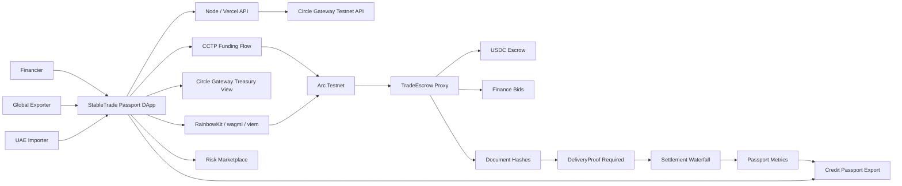

# StableTrade Passport — Hackathon Submission

*Stablecoin Commerce Stack Challenge · Track 2: SME Trade Finance & Working Capital*

---

## 1. Project Title

**StableTrade Passport** — Escrow-secured invoice financing and a portable SME credit passport, settled in USDC on Arc.

---

## 2. One-Line Description

StableTrade Passport turns a single cross-border trade into escrowed USDC settlement, competitive receivables financing, proof-of-delivery release, and a reusable onchain credit history — so SMEs get paid faster and financiers price risk on real repayment data instead of paperwork.

---

## 3. Full Description

**The problem.** SMEs that trade across borders wait weeks for invoices to settle. Importers refuse to release funds without proof of delivery. Exporters need working capital *before* they ship. Financiers who could bridge that gap have no reliable, verifiable repayment history to price the risk. The result is trapped working capital, expensive credit, and stalled trade — especially on emerging-market corridors (UAE → Nigeria, Rwanda, Ghana).

**The solution.** StableTrade Passport runs the entire trade-finance lifecycle on programmable stablecoin rails:

1. **Escrow** — An importer creates an invoice and locks the amount in USDC escrow on Arc.
2. **Finance** — Financiers compete with bids (advance amount + fee bps) against the receivable; the exporter accepts the best offer and receives working capital immediately.
3. **Prove** — Delivery documents are hashed and anchored onchain; settlement is *gated* on a valid `DeliveryProof`.
4. **Settle** — A transparent repayment waterfall pays the financier (principal + fee), deducts the protocol fee, and pays the exporter the remainder — atomically, in USDC.
5. **Passport** — Every completed trade updates a portable **SME credit passport**: settlement behavior, document hashes, and repayment history that any future financier can verify and underwrite against.

**Why it wins.** Most stablecoin demos stop at "send money." StableTrade Passport encodes real *business state* — escrow conditions, competitive financing, proof gates, a settlement waterfall, and a credit-history primitive that compounds in value with every trade. It is the difference between a payment button and a working-capital rail.

---

## 4. Track

**Track 2: SME Trade Finance & Working Capital.**

Track 2 asks for invoice finance, escrow, settlement, working-capital workflows, and verifiable payment history. StableTrade Passport delivers all five:

| Track 2 requirement | How StableTrade Passport delivers it |
| --- | --- |
| Invoice finance | Financier bids and exporter acceptance against onchain receivables |
| Escrow | Importer-funded USDC escrow held by an upgradeable Arc contract |
| Settlement | Atomic repayment waterfall: principal + fee → protocol fee → exporter payout |
| Working-capital workflow | Exporter receives advance before delivery; importer releases on proof |
| Verifiable payment history | SME credit passport built from onchain settlement + document hashes |

---

## 5. Circle Account Email

`<REPLACE_WITH_YOUR_CIRCLE_ACCOUNT_EMAIL>`

> Action required before submitting: replace with the email tied to your Circle Developer Console account.

---

## 6. Products Used

| Circle / Arc product | How it is used in StableTrade Passport |
| --- | --- |
| **USDC** | Single settlement asset for escrow, exporter advance, financier repayment, and protocol fee. |
| **Arc Testnet** | EVM settlement layer running the upgradeable `TradeEscrow` contract: invoices, escrow, bids, document hashes, delivery-proof gating, and settlement. |
| **Circle Gateway** | Treasury Console reads live testnet USDC balances across Arc, Base Sepolia, Ethereum Sepolia, and Arbitrum Sepolia before staging settlement liquidity. |
| **CCTP (+ Bridge Kit / App Kit)** | Cross-chain funding path into Arc, visualized as approve → burn → attestation → mint. |
| **Circle Wallets** | Target onboarding model for non-crypto-native SMEs; the MVP signs testnet actions with RainbowKit + wagmi + viem today. |
| **USYC** | Optional cash-management extension for idle treasury/escrow float where enterprise access is granted. |

---

## 7. Working MVP

**Live demo:** https://stabletradepassport.vercel.app

A fully functional testnet MVP — not mocks. It includes:

- React + Vite DApp with wallet signing (RainbowKit / wagmi / viem).
- Upgradeable Foundry smart-contract stack live on Arc Testnet.
- Node API proxying live Circle Gateway testnet balances.
- Nine judge-navigable pages: Dashboard, Trades, Financing Marketplace, Settlement Waterfall, Treasury Console, CCTP Funding, Agentic Assistant, Credit Passport, System.

**Deployed contracts (Arc Testnet, chain ID `5042002`):**

| Component | Address |
| --- | --- |
| TradeEscrow proxy | `0xF167a3f1E362dBDC7d365A9Cb9340C8513e7188b` |
| StableTradeFactory | `0x2d34ff5B7418e8c1Fcf3EAEc1aeC16EDc7aa6586` |
| TradeEscrow implementation | `0x6f62468D584406d177460Ad2353c7D2C19Ecf6bB` |
| Arc Testnet USDC | `0x3600000000000000000000000000000000000000` |
| Explorer | https://testnet.arcscan.app |

**Core onchain actions:** `createInvoice` → `fundEscrow` → `submitFinanceBid` → `acceptFinanceBid` → `addTradeDocument` → `releaseOnDelivery` (gated on `DeliveryProof`) → `passport(address)`.

> Educational / testnet only. Uses Arc Testnet, testnet USDC, browser-wallet signing, and public-mode endpoint gating. Not a production financial service.

---

## 8. Architecture Diagram

An interactive architecture page ships in the app at **`/architecture.html`** (live: https://stabletradepassport.vercel.app/architecture.html).

---

## 9. Video Demo

**Demo video (≈3 min):** `<REPLACE_WITH_YOUR_VIDEO_URL>` (YouTube or Loom, unlisted is fine)

The video walks the full trade lifecycle: escrow → competitive financing → delivery proof → settlement waterfall → credit passport export, plus live Circle Gateway balances and the CCTP funding path. Script in the repo / submission notes.

---

## 10. Documentation

| Document | Location |
| --- | --- |
| Project overview + run/deploy guide | `README.md` |
| This submission document | `SUBMISSION.md` |
| Frontend guide | `frontend/README.md` |
| Contracts guide | `contracts/README.md` |
| Interactive architecture | `/architecture.html` |
| GitHub repository | https://github.com/fawazdevx/Stabletrade-passport |

---

## 11. Product Feedback (Circle)

**Why these products.** USDC gave importer, exporter, and financier one shared dollar settlement asset, which removed FX friction from every step. Arc gave the escrow contract predictable, fast finality — essential when a settlement waterfall must pay three parties atomically. Gateway let us show treasury liquidity across chains before committing to settlement. CCTP covered the case where a participant starts with USDC on another chain. Circle Wallets map cleanly onto SME onboarding, where raw key management is a non-starter.

**What worked well.** Clean separation of concerns — USDC as settlement asset, Arc as the programmable rail, Gateway as the treasury view, CCTP as the funding path, Wallets as the onboarding layer. Arc's EVM compatibility meant our Foundry workflow (build, test, upgradeable proxy) worked with zero surprises.

**What could be better.** Developers need more end-to-end samples that combine *multiple* Circle products in one sandbox with real business state — not just transfer screens. Documentation for the Gateway testnet balances API and CCTP attestation flow was the slowest part of integration.

**Recommendation.** Publish an official "SME invoice escrow on Arc" reference app: upgradeable escrow contracts, testnet Gateway + CCTP examples, document-hash anchoring, a settlement-waterfall UI, and a credit-passport export. That single sample would dramatically cut integration time for any team building working-capital or trade-finance workflows on Circle's stack.

---

## 12. Submission Form Quick-Fill

Copy-paste into the challenge form:

- **Project title:** StableTrade Passport
- **Track:** Track 2 — SME Trade Finance & Working Capital
- **GitHub Repository Link:** https://github.com/fawazdevx/Stabletrade-passport
- **Product Demo Video Link:** `<REPLACE_WITH_YOUR_VIDEO_URL>`
- **Live MVP:** https://stabletradepassport.vercel.app
- **Circle account email:** `<REPLACE_WITH_YOUR_CIRCLE_ACCOUNT_EMAIL>`
- **Submission Document:** upload this file (export `SUBMISSION.md` to PDF)

---

*License: MIT.*
